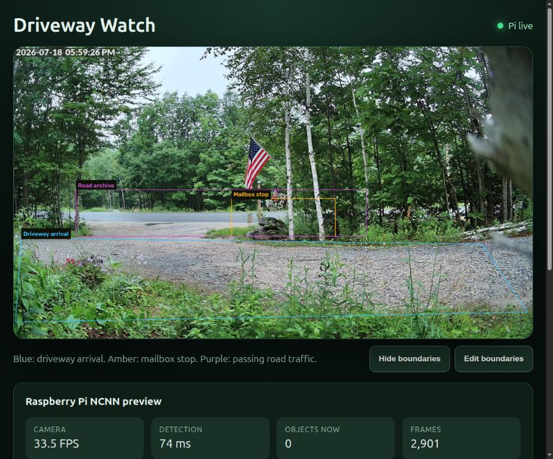

# AI Driveway Watch

An agent-friendly, local-first driveway and roadside camera monitor for a
Raspberry Pi 5. It decodes one RTSP/RTSPS stream with OpenCV 5, runs YOLOv8n
through Tencent NCNN, and serves a phone-friendly dashboard without sending
video to a cloud vision service.



## What it does

- driveway arrivals: person and vehicle snapshots with configurable cooldowns;
- mailbox stops: alerts only after a vehicle remains nearly stationary;
- animals: one cooldown-controlled alert when a supported animal enters any
  configured boundary;
- road traffic: a separate, no-alert archive with one snapshot per tracked
  passing vehicle;
- ntfy notifications: optional text-only phone alerts for driveway, mailbox,
  and animal events;
- local dashboard: live video, full-screen event images, archive tabs, and
  confirmed deletion;
- headless service: designed to restart automatically on a Raspberry Pi.

The colored polygons are configured as normalized `x,y` points:

- blue: driveway arrival zone;
- amber: mailbox stop zone;
- purple: passing road-traffic zone.

The dashboard also includes a touch-friendly boundary editor. Select a boundary
type, give it a useful label, and tap the corners on the live image. Changes are
kept as a draft until **Save changes** is pressed. **Cancel** discards the draft,
and **Restore original boundaries** always returns to the startup values from
`.env`, so a field adjustment cannot permanently lose a known-good calibration.
Saved edits live in `OUTPUT_DIR/zones.conf` and survive service restarts.
Each phone or browser can independently hide the colored boundary lines. The
display preference is stored only in that browser and never changes detection,
alerts, or the saved zone configuration.

`DETECTION_FPS` controls how often the detector examines a frame independently
of the camera and dashboard stream rate. Start at `5`; a cooled Raspberry Pi 5
can often run `8` comfortably. Increase it only while inference time remains
well below the frame interval and the Pi reports no thermal throttling.

## Hardware used for the reference build

- Raspberry Pi 5, 16 GB;
- 1280x720, 30 FPS RTSPS camera stream;
- NVMe storage;
- OpenCV 5 and Tencent NCNN installed in isolated prefixes.

The reference Pi sustained five detections per second while decoding the live
stream at full frame rate. See [the measured results](cpp_pi_ncnn/README.md).

## Quick start

Install OpenCV 5 and NCNN first. The reference paths are:

```text
$HOME/.local/opencv-5/lib/cmake/opencv5
$HOME/.local/ncnn/lib/cmake/ncnn
```

Then fetch the pinned Qengineering detector assets and build:

```bash
cd cpp_pi_ncnn
./fetch_qengineering_assets.sh
cmake -S . -B build \
  -DOpenCV_DIR="$HOME/.local/opencv-5/lib/cmake/opencv5" \
  -Dncnn_DIR="$HOME/.local/ncnn/lib/cmake/ncnn"
cmake --build build --parallel 2
cp ../.env.example .env
```

Edit `.env` and set `CAMERA_URL`. Camera URLs are credentials: never paste one
into an issue, prompt transcript, screenshot, or commit.

Run from `cpp_pi_ncnn` so the model files are found:

```bash
./build/driveway_ncnn_server
```

Open `http://PI_ADDRESS:8000/` from a device on the same network.

## Permanent service

The example [systemd unit](cpp_pi_ncnn/driveway-watch.service) uses the
dedicated account `driveway-watch` and installs under
`/opt/ai-driveway-watch/cpp_pi_ncnn`. Adjust those paths if you deploy
elsewhere. Keep the production `.env` readable only by the service account.
See the [Pi service installation guide](docs/INSTALL_PI.md) for the complete
copy, permission, enable, and rollback sequence.

Do not forward port 8000 from the router. Use a private overlay network such as
Tailscale if remote dashboard access is needed. ntfy alerts work independently
of local dashboard access.

## AI-first workflow

This repository is intentionally prepared for coding agents:

- [AGENTS.md](AGENTS.md) records invariants, privacy rules, and verification;
- [architecture notes](docs/ARCHITECTURE.md) explain the event pipeline;
- [roadmap](docs/ROADMAP.md) tracks planned editor refinements and other features;
- [agent prompts](prompts/README.md) provide safe starting tasks for
  calibration, missed detections, and notification integrations.

Agents should edit `.env` only on the target device, never echo its values, and
use screenshots that have been explicitly approved for sharing.

## Repository layout

```text
cpp_pi_ncnn/   Raspberry Pi C++/NCNN service and benchmark
app/           earlier Python/OpenCV 5 prototype
cpp_pi/        earlier OpenCV 5 decoding benchmark
prompts/       reusable agent prompts
docs/          architecture, privacy, and roadmap
tests/         Python prototype tests
```

## Privacy and limitations

- A random public ntfy topic is a bearer secret, not full authentication.
- The service classifies common COCO objects; it does not identify people,
  license plates, or whether a vehicle truly belongs to a mail carrier.
- The standard model recognizes bird, cat, dog, horse, sheep, cow, elephant,
  bear, zebra, and giraffe. It has no dedicated deer class, so wildlife may be
  reported as the closest supported animal or occasionally missed.
- Mailbox alerts intentionally say “vehicle stopped near mailbox.”
- Comply with local camera, audio, notice, and data-retention laws.

See [SECURITY.md](SECURITY.md) before exposing any part of the service beyond a
trusted LAN.

## Licensing and attribution

Project-authored code is MIT licensed. The asset installer downloads pinned
files from
[Qengineering/YoloV8-ncnn-Raspberry-Pi-4](https://github.com/Qengineering/YoloV8-ncnn-Raspberry-Pi-4),
which are covered by Qengineering’s BSD 3-Clause license. The installer also
downloads that upstream license alongside the assets.

See [ACKNOWLEDGEMENTS.md](ACKNOWLEDGEMENTS.md) for the project’s human, AI, and
open-source collaboration credits.
